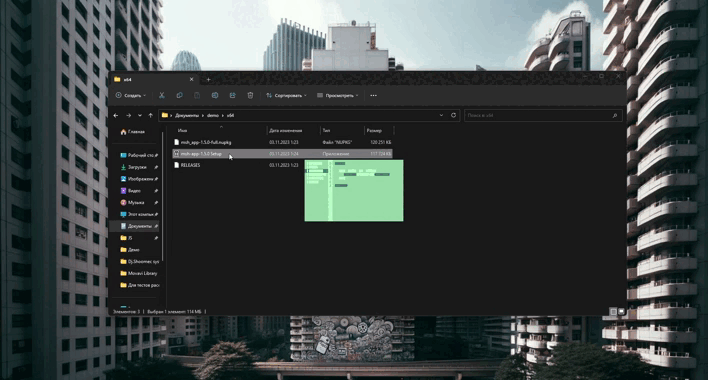
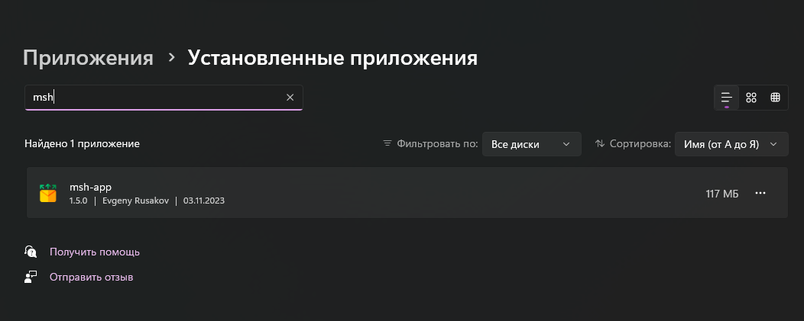
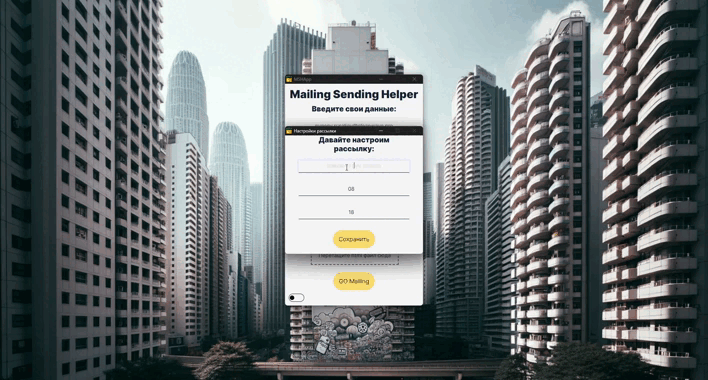
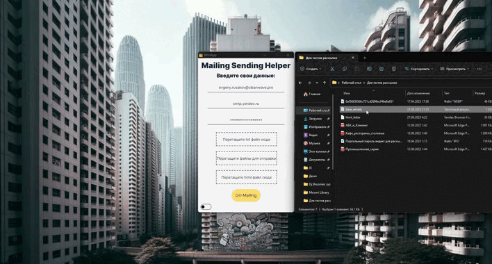
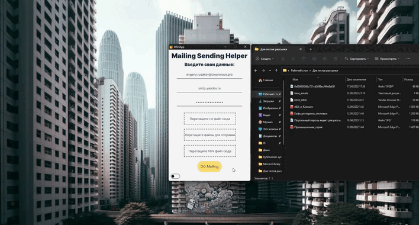
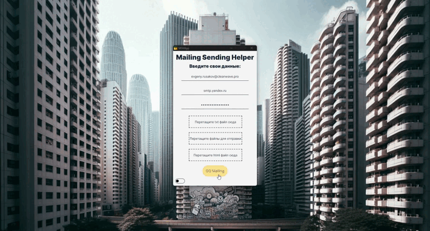
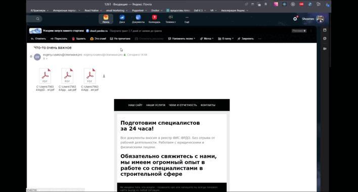

# MSH-App-Demo
Если не хотите читать Readme можете ознакомиьться с проектом в [MSH_App_Bot в Телеграм](https://t.me/MSH_App_Bot), кторый кстати тоже мой пет проект написанный на __Nest-telegraf__ и __MongoDB.__


Данный проект является полноценным сервисом созданным на фреймворке __Electron__ для рассылки html писем, по базе email адресов из списка txt. Программа имитирует работу реального человека и работает с понедельника по пятницу, в остальное время программа откладывает запуск и сообщает об том пользователю. Можно настроить время начала и конец рабочего дня для рассылки. Письма отправляются с интервалом, он рандомный и варьируется от 1 минуты до 1 минуты 30 сек. Сообщения о статусе рассылки приходят в telegram.
***
## Запуск проекта

Для запуска необходимы Node.js старше 16.x, OS Windows не ниже 10 версии. 
Если все требования соблюдены просто запустите __msh-app-Setup.exe__.

Далее представлены текстовые и визуальные представления возможностей проекта.
***
## Установка
Используется сборщик __Electrone Forge.__ Можно собрать для всех известных ОС
- Для macOS (zip)
- Для Linux (deb и rpm)
- Для Windows (wix и squirrel)



После установки программа будет отображаться в установленных программах вашей ОС.


***
## Окно настроек
При запуске приложения необходимо ввести тему письма и время начала и конца рабочего дня. Пока не будут заполнены все поля, приложение не даст перейти к главному рабочему окну программы. 


***
## Главное окно
На главном окне необходимо ввести свою почту, пароль приложения и имя smtp сервера через который будет производитьмся рассылка. Так же можно сменить тему со светлой на темную.


***
## Закидываем данные для рассылки
Для начала расслыки программа ожидает базу email адресов в txt файле и сверстанное html письмо. Эти файлы необходимо перекинуть в предназначенные dnd зоны для txt и html файлов. Так же можно включать в рассылку вложения. Разрешенные типы файлов для вложений ```.jpg, .jpeg, .png, .gif, .pdf, .txt, .doc, .docx, .xls, .xlsx```.



Приложение не запустится если не будет предоставлено нужных файлов для его работы.


***
## Рассылка писем
После старта рассылки на главной кнопке приложения начнет работать лоадер, а внизу приложения будет заполняться прогресс бар. Во время выполнения рассылки нет возможности добавлять вложени или менять базу и файл письма. Как только в файле с базой почт не окажется email'ов приложение уведомит об этом в всплывающем окне и в telegram. 


***
## Итог выполнения программы
В случае если письмо не попало в спам и успешно дошло до адресата в списке, пользователь получит письмо сверстанное на фреймворке __MJML.__ 

